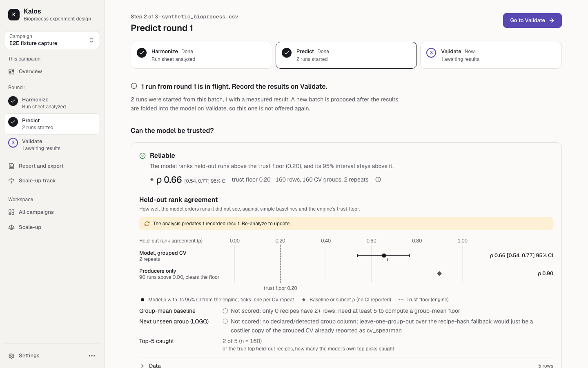
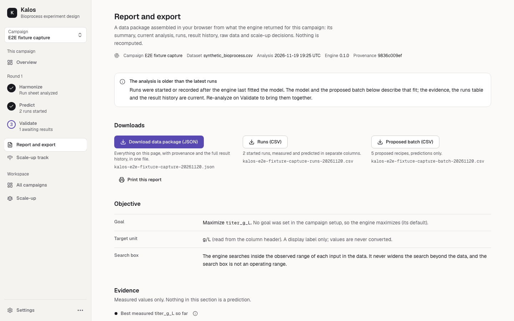
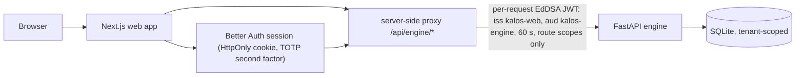

# Kalos web

[](https://github.com/itsbrendandang/kalos-web/actions/workflows/ci.yml)

> **Status: under development. Not a public SaaS.**
> Kalos is a scientific optimization platform being built toward a public SaaS.
> There is no hosted service. Sign-in (with a required second factor), organizations as tenants and an authenticated engine proxy are implemented on `main` (see [Security model](#security-model)), but the app has not been independently reviewed and is not offered as a service.
> The optimizer behind it is not scientifically validated (see [Scientific status](#scientific-status)).

## Overview

Kalos web is the scientist-facing app for the [Kalos engine](https://github.com/itsbrendandang/kalos-engine), built with Next.js 16 and Tailwind v4.
You create a campaign and work it in repeating cycles: **Harmonize** (upload past runs, check the sheet, see the explored range), **Predict** (check how far the model can be trusted, review the proposed batch with its intervals), **Validate** (record measured results, compare them with the predictions, re-analyze), then export a data package with provenance.
The engine does the modelling; this app presents it and keeps predicted and measured values apart.

**Engine requirement:** the app needs the engine APIs from [kalos-engine#164](https://github.com/itsbrendandang/kalos-engine/pull/164) (campaign setup, stages and gates, run bands recorded at start, re-analysis jobs, exports) or later.
The trust-layer fields (proposal-coverage caveat, engine verdict, exploration labels, held-out grouping) come from [kalos-engine#166](https://github.com/itsbrendandang/kalos-engine/pull/166) or later; every one is optional, and without them the app says the coverage at proposals is unknown for that engine version and uses its own verdict rule.

Intended users (the product is not available to external users yet): process-development scientists running iterative media or process optimisation campaigns, and small teams that want a propose-measure-re-propose loop with an honest read on model reliability.

## Related repositories

Kalos is three repositories with a clear split:

- **kalos-web** (here) — the scientist-facing app (Next.js + Tailwind v4).
- **[kalos-engine](https://github.com/itsbrendandang/kalos-engine)** — the optimization engine and FastAPI service this app reads over an authenticated same-origin proxy. Run it first; it serves the API on `http://127.0.0.1:8050`.
- **kalos-workspace** (private) — the project hub: working notes, reviews, research, plans, and the cross-machine handoff. No product code.

## Screenshots

One campaign on the engine's generated example sheet (`synthetic_bioprocess.csv`, not measured data), local development build against a local engine at #164 or later, light theme, 1440 px wide.
The recorded result and its correction were typed in by an end-to-end test, not measured.

| Overview | 1 Harmonize |
| --- | --- |
|  |  |
| **2 Predict** | **3 Validate** |
|  |  |
| **Report** | |
|  | |

## Capabilities

**IMPLEMENTED** = on `main` with tests or a verifiable route; **EXPERIMENTAL** = present but demo/seed data or unvalidated; **PLANNED** = not built.

| Capability | Status | Evidence |
| --- | --- | --- |
| Multiple campaigns, each worked as Harmonize -> Predict -> Validate cycles against the live engine (multi-campaign API) | IMPLEMENTED | `app/page.tsx`, `app/campaigns/[id]/*`, `hooks/use-engine.tsx`, `__tests__/campaigns-client.test.ts`, `__tests__/app-shell.test.tsx` |
| Upload a run sheet as an engine background job with engine-reported progress and cancel; view the data-quality findings and explored design space | IMPLEMENTED | `app/campaigns/[id]/harmonize/page.tsx`, `__tests__/harmonize-page.test.tsx`, `__tests__/validation.test.ts` |
| Record results with versioned corrections (reason required), re-analyze, compare measured with predicted | IMPLEMENTED | `app/campaigns/[id]/validate/page.tsx`, `__tests__/validate-page.test.tsx` |
| Report and export: JSON data package and CSVs built only from engine outputs, with provenance hashes | IMPLEMENTED | `app/campaigns/[id]/report/page.tsx`, `lib/report-package.ts`, `__tests__/report-package.test.ts` |
| Reliability verdict and uncertainty bands, measured never mixed with predicted | IMPLEMENTED | `lib/api.ts`, `lib/num.ts`, `__tests__/reliability-verdict.test.ts`, `__tests__/num.test.ts`, `__tests__/overview.test.ts` |
| Trust layer: proposal-coverage caveat on every proposal interval, "not judged" verdict, exploration vs model-guided labels, refusals with reasons, held-out grouping | IMPLEMENTED (renders optional engine fields) | `lib/proposal-caveat.ts`, `lib/proposal-trust.ts`, `components/predict/trust-panel.tsx`, `__tests__/trust-caveat-guard.test.tsx`, `__tests__/trust-verdict.test.tsx` |
| Charts (visx): reliability scorecard, parity, calibration, driver forest, batch interval strip, validation dumbbells, progress, scale ladder, stage-gate track | IMPLEMENTED | `components/viz/`, `lib/viz-data/`, `__tests__/viz-*.test.ts*`, `__tests__/design-guards.test.ts` |
| Campaign setup before the first upload: target, maximize or minimize, unit, optional bounds (never wider than the data) and linear constraints, applied by the engine on upload and re-analysis | IMPLEMENTED | `components/setup/*`, `__tests__/setup-logic.test.ts`, `__tests__/harmonize-page.test.tsx` |
| Sign-in with Better Auth (Google), TOTP second factor required, organizations and members | IMPLEMENTED | `lib/server/auth-config.mjs`, `lib/server/session.ts`, `__tests__/auth-session.test.ts`, `__tests__/session-context.test.ts` |
| Authenticated engine proxy: exact route table with per-route scopes from the engine manifest, CSRF, tenant map, rate limits, body caps, per-request 60 s EdDSA engine token, audit line | IMPLEMENTED | `lib/server/engine-proxy.ts`, `lib/server/engine-routes.ts`, `lib/server/engine-token.ts`, `__tests__/engine-proxy.test.ts`, `__tests__/engine-routes.test.ts`, `__tests__/csrf.test.ts` |
| Archive and unarchive campaigns (organization admin, second factor within 5 minutes) | IMPLEMENTED | `components/home/archive-dialog.tsx`, `lib/server/engine-proxy.ts`, `__tests__/home.test.ts` |
| Security headers (CSP, HSTS, frame and content-type protections), production boot check, loopback dev server | IMPLEMENTED | `lib/security-headers.ts`, `lib/server/boot-check.ts`, `__tests__/security-headers.test.ts`, `__tests__/boot-check.test.ts` |
| App shell: sidebar with campaign switcher and the cycle steps' engine state | IMPLEMENTED | `components/shell/app-shell.tsx`, `__tests__/app-shell.test.tsx` |
| Scale-up readout (predict or refuse), and a per-campaign stage track backed by the engine's gate registry: a person records each go/no-go with a required note, the engine keeps every decision's history, and computed evidence sits beside the gate but never decides it | IMPLEMENTED (engine-backed; readout evidence is synthetic) | `app/scale-up/page.tsx`, `app/campaigns/[id]/scale-up/page.tsx`, `components/scale/*`, `lib/viz-data/stage-gate.ts`, `__tests__/viz-stage-gate.test.ts`, `__tests__/scale-readout.test.ts` |
| Example data on the campaigns home (off by default) | EXPERIMENTAL | `lib/demo.ts`, `lib/mock/campaign.ts`, `components/home/demo-preview.tsx` |
| Editable column confirmation (the one place to change the target after an upload), `data_type` row counts, stale-analysis handling, xlsx worksheet selector | IMPLEMENTED | `components/campaign/column-confirm.tsx`, `lib/setup-attempt.ts`, `lib/sheet-choice.ts`, `__tests__/setup-attempt.test.ts`, `__tests__/sheet-choice.test.ts`, `__tests__/xlsx-scan.test.ts` |

## Architecture


```mermaid
flowchart LR
  B[Browser] --> W["Next.js web app"]
  W --> A["Better Auth session (HttpOnly cookie, TOTP second factor)"]
  W --> P["server-side proxy /api/engine/*"]
  A --> P
  P -->|"per-request EdDSA JWT: iss kalos-web, aud kalos-engine, 60 s, route scopes only"| E["FastAPI engine"]
  E --> S[("SQLite, tenant-scoped")]
```

The browser never calls the engine directly: it calls the same-origin proxy, which checks the session and mints a short-lived engine token on the server.
The engine verifies that token against the web's public key (JWKS) and takes the tenant from it, never from the request.
Design and threat model: [`docs/ENGINE_AUTH.md`](docs/ENGINE_AUTH.md) and [`docs/AUTH.md`](docs/AUTH.md).

## What you can do

The app has one left sidebar: a campaign switcher, the current campaign's Overview, its three numbered cycle steps with the engine's own stage state, Report and export, the campaign's Scale-up track, then All campaigns, Scale-up and Settings.
See `docs/REDESIGN.md` for which engine capability backs each page.

| Page | Route | What it does |
| --- | --- | --- |
| Campaigns | `/` | Every campaign with its measured best, model reliability, stage, latest gate decision and running job (one summary request); start a new one; archive and unarchive (organization admins, recent second factor) |
| Overview | `/campaigns/[id]` | Where the campaign is, the engine's next action, measured best so far, model reliability |
| 1 Harmonize | `/campaigns/[id]/harmonize` | Pick the prior-runs sheet, choose the target and the campaign setup (maximize or minimize, unit, optional bounds and linear constraints), upload it as a background job with progress, read the data check, the explored range and how the setup was applied |
| 2 Predict | `/campaigns/[id]/predict` | Can the model be trusted (CV, calibration, promotion as reported), drivers, the proposed batch with intervals; start runs |
| 3 Validate | `/campaigns/[id]/validate` | Runs in the lab, record and correct results, predicted vs measured, re-analyze and re-propose |
| Report | `/campaigns/[id]/report` | Download the data package (JSON) and CSVs, raw rows, result history with corrections, operating ranges or why they were not computed; print |
| Scale-up track | `/campaigns/[id]/scale-up` | The campaign's current stage and its go/no-go gates, each decided and noted by a person, with the engine's evidence beside it; run a readout to link to a decision |
| Scale-up | `/scale-up` | The predict-or-refuse scale-up readout, and links to each campaign's track |
| Settings | `/settings`, `/settings/organization`, `/settings/security` | Theme, engine connection, optional integrations; members and invitations; second factor |

Pages without an engine behind them (Data registry, Vessels, Plate, Projects, Simulator) were removed.
Older routes redirect (`next.config.ts`): `/campaign/*`, `/data`, `/projects*`, `/library*` and the pre-2026-10 routes go to `/`; `/library/scale-up` and `/scale-readout` go to `/scale-up`.

## Local development

Prerequisites: Node 22 (CI pins 22.16.0) and npm; for the engine, [uv](https://docs.astral.sh/uv/) and Python 3.11 or 3.12; a Google OAuth client for sign-in ([`docs/AUTH.md`](docs/AUTH.md)) and an authenticator app for the second factor.
All tools are free and open source.

1. Web: install, configure, and create the engine signing key and its public JWKS ([`docs/ENGINE_AUTH.md`](docs/ENGINE_AUTH.md), section 3):

   ```bash
   npm ci
   cp env.example .env.local        # then fill in real values; never commit it
   node -e "process.stdout.write(require('node:crypto').generateKeyPairSync('ed25519').privateKey.export({type:'pkcs8',format:'pem'}))" > engine-jwt.pem
   KALOS_ENGINE_JWT_PRIVATE_KEY_FILE=engine-jwt.pem KALOS_ENGINE_JWT_KID=dev \
     node scripts/engine-jwks.mjs > engine-jwks.json
   ```

   In `.env.local` set `KALOS_ENGINE_JWT_PRIVATE_KEY_FILE` and `KALOS_ENGINE_JWT_KID` to the same key and id, `KALOS_TENANT_MAP_FILE=./tenants.json`, and the Google client id and secret.

2. Engine: from a [kalos-engine](https://github.com/itsbrendandang/kalos-engine) checkout at PR #164 or later, trusting that JWKS:

   ```bash
   uv sync --python 3.11 --extra ml --extra portal
   KALOS_JWT_PUBLIC_KEYS_FILE=/path/to/engine-jwks.json KALOS_JWT_ISSUER=kalos-web \
     KALOS_JWT_AUDIENCE=kalos-engine uv run python -m kalos.portal    # http://127.0.0.1:8050
   ```

3. Web: create the auth database, start the dev server, and create your organization ([`docs/AUTH.md`](docs/AUTH.md), "Running it locally"):

   ```bash
   mkdir -p data
   AUTH_MIGRATE=1 npm run dev        # binds 127.0.0.1:3000
   node scripts/create-org.mjs --name "Dev" --slug dev --owner-email you@gmail.com \
     --tenant dev --tenant-map ./tenants.json --public-url http://localhost:3000
   ```

   Open the printed invitation link, sign in with Google, and enrol the second factor.
   `.env.local`, `engine-jwt.pem` and `data/` are gitignored; `tenants.json` and `engine-jwks.json` are not, so keep them out of commits.

Open `http://localhost:3000`, not `http://127.0.0.1:3000`: Next 16 dev mode does not treat `127.0.0.1` as the same origin as `localhost`, which can break hot reload and client hydration.

The browser never calls the engine directly.
It calls the same-origin proxy at `/api/engine/*` (`app/api/engine/[...path]/route.ts`), which checks the session and forwards to the engine with a short-lived token minted on the server.
The engine-facing variables (placeholders and the rest in [`env.example`](env.example)):

| Variable | Where | What it does |
| --- | --- | --- |
| `KALOS_ENGINE_URL` | server only | Engine base URL, for example `http://127.0.0.1:8050`. If unset, the proxy answers 502 "engine unreachable". |
| `KALOS_ENGINE_JWT_PRIVATE_KEY_FILE`, `KALOS_ENGINE_JWT_KID` | server only | The Ed25519 key the proxy signs per-request engine tokens with, and its key id. The engine trusts the matching public JWKS. |
| `KALOS_TENANT_MAP_FILE` | server only | Maps each organization to its engine tenant (written by `scripts/create-org.mjs`). Unmapped organizations are refused. |
| `KALOS_ENGINE_TOKEN` | not used | There is no static engine token. A `KALOS_ENGINE_TOKEN` left in the environment is ignored and never sent. |
| `NEXT_PUBLIC_DEMO_MODE` | build time | `true` shows a badged example campaign on the home page when the engine has no campaigns at all. Default off. |
| `NEXT_PUBLIC_API_URL` | build time | Local-dev escape hatch (not available in the Docker image) that points the browser straight at an engine and bypasses the proxy. Do not use it with an engine that requires auth: the browser would call it with no session check and no token. |

To try the app with data, create a campaign and upload the engine repo's generated example sheet (`examples/synthetic_bioprocess/synthetic_bioprocess.csv`) on Harmonize.

## Proxy routes

The proxy (`app/api/engine/[...path]/route.ts`, logic in `lib/server/engine-proxy.ts`) forwards only the routes in an exact method + path table (`lib/server/engine-routes.ts`): the multi-campaign API (`/api/campaigns`, a campaign's detail, analysis, runs and results, setup, stages and gates, exports, result history, operating ranges), the background jobs for uploads and re-analyses, the JSON scale-up readout, and the optional-providers list.
GET, POST, PUT and PATCH are used; anything not in the table is 404 (unknown path) or 405 (known path, other method).
The legacy single-campaign routes (`/api/run`, `/api/latest`, `/api/campaign/*`), the demo simulators, the HTML scale readout and the synchronous upload and re-analysis routes were removed from the table once nothing called them.
Each route declares the engine scopes it needs, taken from the engine's published per-route scope manifest (vendored as `__tests__/fixtures/engine-route-scopes.json` and checked by `__tests__/engine-routes.test.ts`), not derived from the HTTP method.
The engine URL comes only from `KALOS_ENGINE_URL`, never from the request; request and response headers are allow-listed (no `Set-Cookie` comes back).

## Security model

What the code does today, per proxied request, in this order (each step fails closed; nothing reaches the engine until all pass):

- **Route table and path checks.** Exact routes only; traversal, encoded slashes or dots, double encoding and NUL are refused.
- **CSRF.** State-changing requests need an exact `Origin` match with the app's public origin, consistent `Sec-Fetch-Site` / `Referer` when present, and the custom `X-Kalos-CSRF: 1` header; bodies must be JSON or multipart (`lib/server/csrf.ts`). Cross-site reads are refused too.
- **Session.** Resolved server-side from the HttpOnly session cookie (Better Auth, `lib/server/session.ts`). A session without a verified second factor (TOTP) cannot use the proxy (403 `MFA_REQUIRED`).
- **Tenant.** Mapped from the active organization through the operator's tenant map file (`lib/server/tenants.ts`). Unmapped organizations get 403; there is no default tenant, and nothing the client sends picks the tenant.
- **Scopes.** The member's role (or the auth provider's permissions) gives `campaigns:read`, `campaigns:write` and, for admins, `org:admin` (`lib/server/scopes.ts`). The minted token carries only the scopes the route needs.
- **Admin actions.** Archiving or unarchiving a campaign (PATCH with `archived`) needs `org:admin` and a second factor verified within the last 5 minutes (`RECENT_AUTH_MAX_AGE_SECONDS` in `lib/server/session-context.ts`); otherwise 403 `insufficient_scope` or 403 `step_up_required`. The engine then refuses writes to archived campaigns (409 `campaign_archived`).
- **Rate limits.** In memory, per process: 120 requests a minute per session, 30 writes a minute per session, 600 requests a minute per tenant (429 with `Retry-After`). With several replicas the effective limit multiplies.
- **Body caps.** JSON bodies are capped at 1 MiB and uploads at the configured upload limit, checked on the declared length and while streaming (413).
- **Engine token.** A 60-second EdDSA JWT (`lib/server/engine-token.ts`), signed with a key from `KALOS_ENGINE_JWT_PRIVATE_KEY_FILE`; the browser never sees the token, the engine URL or the tenant id.
- **Audit.** Every proxied request writes one `[kalos-audit]` line to the server log with the request, user, session, tenant and token ids, the route template, the status and the outcome; never bodies, queries, headers, emails or IP addresses.

Also in place:

- **Security headers** on every response (`lib/security-headers.ts`): CSP, HSTS, `X-Frame-Options: DENY`, `nosniff`, a strict referrer policy and a restrictive permissions policy. The CSP `script-src` still allows `'unsafe-inline'` (the statically rendered pages need it; see the comment in that file).
- **Production boot check** (`lib/server/boot-check.ts`): the server refuses to start when a required secret is missing or still a placeholder.
- **Self-hosted fonts:** no third-party font requests (`__tests__/self-hosted-fonts.test.ts`).
- `npm run dev` binds to `127.0.0.1` only.

Known limits:

- A token already minted stays valid for up to 60 s plus the engine's leeway after sign-out or a role change; the engine keeps no replay cache.
- Rate limits and the tenant map are per process and read from local state; see "Known limits" in `docs/ENGINE_AUTH.md`.
- Engine-side security findings are tracked in the engine repository.
- Not independently audited. No compliance or certification claims.

## Scientific status

This app displays engine output; it does not validate it.
**The engine's optimizer is not scientifically validated, and there is no live-lab result.**
In the engine's own words (its caveat text from [kalos-engine#193](https://github.com/itsbrendandang/kalos-engine/pull/193) on): each proposal's 90% range "was sized on the held-out past runs the model ranked highest, to mimic how proposals are chosen. At proposed recipes this 90% range covered 86-99% in simulation, below 90% in some cases (measured, not guaranteed)." The app shows that text as the engine sends it, never its own copy. The reliability verdict can look better than it is when batch or round effects are not declared as groups, and the optimizer searches only inside the observed range of each input.
Details, benchmarks and their limits: [engine README, "Validation and its limits"](https://github.com/itsbrendandang/kalos-engine#validation-and-its-limits).

The UI's reliability verdict follows the engine and is never more optimistic than it: the app never says "Reliable" while the engine's verdict is not yet reliable or refused, and says "Not judged: too few runs" when the engine does not judge the trust floor (`reliabilityVerdict` in `lib/api.ts`).
For older analyses without a verdict, it falls back to a transparent rule on the held-out rank agreement and its interval against the engine's trust floor.
Neither is a guarantee.

## Current limitations

- The campaign list follows the engine's pages (200 campaigns each) up to 25 pages; beyond that it says "showing N of more" rather than look complete.
- Bounds and linear constraints narrow the search inside the observed data only; the engine does not extrapolate, and it refuses linear constraints when the design has a categorical input, unless the categorical is a declared clone column (engine `docs/CLONES.md`, "Linear constraints with a clone").
- Everything the UI can do depends on a running engine; there is no offline mode.
- A few older pages still show internal engine vocabulary.

## Roadmap

- **MVP (toward a public beta):** IMPLEMENTED on `main`: campaign workspace, multiple campaigns, background jobs, campaign setup, scale-up tracks with recorded gate decisions, Better Auth sign-in with a second factor, organizations as tenants, the authenticated proxy with per-request engine tokens.
- **Later (PLANNED):** external security review, validation of the optimizer on independent real data.

## $0 stack

Next.js, React, Tailwind, Base UI, visx, Vitest, GitHub Actions, and a local engine with SQLite. Local development needs no paid service (the Google OAuth client is free).

## Honest by design in the UI

Each rule names the file that carries it.

- One reliability verdict app-wide ("Reliable", "Not yet reliable", "Not judged: too few runs", "Not enough data"), computed in one place and following the engine's own verdict when it sends one: `reliabilityVerdict` in `lib/api.ts`, tested in `__tests__/reliability-verdict.test.ts` and `__tests__/trust-verdict.test.tsx`.
- Every proposal interval carries the coverage caveat: the band states what it was sized on and the coverage the engine measured at proposed recipes.
  The engine's own caveat text and its measured coverage-at-proposals estimate are rendered as sent; an engine that sends neither gets a fixed sentence saying the coverage at proposals is unknown for that engine version. Nothing next to a proposal says "calibrated".
  `lib/proposal-caveat.ts`, guarded by `__tests__/trust-caveat-guard.test.tsx` across Predict, the batch strip, the Report and the exported package.
- Each proposal is labelled "model-guided" or "exploration: model not trusted yet" from the engine's verdict, including in the CSV and data package; a refused batch shows no proposals, the engine's reason and what would help: `lib/proposal-trust.ts`, `__tests__/trust-verdict.test.tsx`.
- The held-out score names the grouping that produced it (for example "held-out by batch (5 groups)"): `cvGroupingText` in `lib/api.ts`, `components/predict/trust-panel.tsx`.
- A measured result is judged inside or outside only against the band the engine recorded when that run started, never today's band; runs without a recorded band are labelled and left out of the hit rate: `components/campaign/learn.ts`, `lib/viz-data/validation-dumbbells.ts`, `__tests__/learn.test.ts`, `__tests__/viz-validation-dumbbells.test.ts`.
- Every number through one formatter, with precision from the reported uncertainty and a coverage percentage only when the engine sent one: `formatValue` in `lib/num.ts`, tested in `__tests__/num.test.ts`; no hand-typed 90% or 95% in components (`__tests__/design-guards.test.ts`).
- Measured and predicted values are never mixed.
  Best so far comes from the campaign's measured results, never a prediction: `lib/overview.ts`, `__tests__/overview.test.ts`.
- Go/no-go gate decisions are recorded by a person with a note; a go does not advance the stage and a no-go pauses later stages: `lib/viz-data/stage-gate.ts`, `__tests__/viz-stage-gate.test.ts`.
- Example data wears a visible "Example data" badge and renders only when `NEXT_PUBLIC_DEMO_MODE=true`: `ExampleBadge` in `components/ui/badge.tsx`, `lib/demo.ts`.
- State is never carried by color alone.
  Status colors pair with a word or icon, and text and UI color pairs are checked for WCAG contrast in both themes: `__tests__/contrast.test.ts`.
- No side-stripe borders on callouts or cards: `__tests__/design-guards.test.ts`.
- No engine vocabulary in copy.
  This is a design rule (see `DESIGN.md`), not a test, and some engine reasons are still shown verbatim.

## Live vs demo data

| Route | Source |
| --- | --- |
| `/`, `/campaigns/*` | Engine multi-campaign API (`/api/campaigns*`, `/api/jobs/*`). With demo mode on and no campaigns at all, `/` also shows a badged example preview from `lib/mock/campaign.ts`. |
| `/campaigns/[id]/scale-up` | Engine stage and gate registry (`/api/campaigns/{id}/stages`, `/gates`, `/gates/{gate}/history`). The current stage and each decision are recorded by a person; the software never advances a stage or decides a gate. |
| `/scale-up` | Engine (`POST /api/scale/readout.json`). |
| `/settings` | Engine (`/api/providers`, and the connection check). |

## Design system

- Geist and Geist Mono, self-hosted with `next/font/local` (no Google Fonts requests, enforced by `__tests__/self-hosted-fonts.test.ts`).
- Light first, with full dark mode.
- OKLCH tokens defined once in `app/globals.css`, exposed through Tailwind v4 `@theme inline`.
- shadcn/ui primitives on Base UI in `components/ui/`, shared pieces in `components/kit/`.
- Charts are visx SVG in `components/viz/charts/`, with pure data adapters in `lib/viz-data/` and numbers formatted through `lib/num.ts` (`components/viz/num.tsx` for display). Recharts and the earlier Tremor copies are gone, enforced by `__tests__/design-guards.test.ts`.

[`DESIGN.md`](DESIGN.md) has the token reference, type scale and layout rules.

## Development and CI

CI (`.github/workflows/ci.yml`, Node 22.16.0) runs these on pushes to `main` and on pull requests (drafts skipped):

```bash
npm ci
npm run lint
npm run test
npm run build
```

CI also runs `npm run test:auth-integration` (Better Auth against a temporary SQLite database and a fake Google). Pushes and pull requests that change only Markdown, `docs/` or `LICENSE` skip CI.
`npm run build` is also the type-check gate; there is no separate `tsc` step (the workflow explains why).

## Deploy

This repo has its own [`Dockerfile`](Dockerfile): a multi-stage build on `node:22-alpine` that runs the Next.js standalone output as a non-root user, with a health check.
The compose stack that runs the engine, this app and a backup sidecar together lives in the engine repo, and its [`deploy/RUNBOOK.md`](https://github.com/itsbrendandang/kalos-engine/blob/main/deploy/RUNBOOK.md) has the quickstart, the security checklist and the backup drills; see the static-token limit under [Security model](#security-model).
The web's auth database, migrations and backups are covered in [`docs/AUTH.md`](docs/AUTH.md).
The app has not been independently reviewed; do not expose it publicly.

## Contributing

- Run the CI commands above and make sure all of them are green.
- Conventional commits (`feat:`, `fix:`, `docs:`, `chore:`); one focused pull request per change.
- PR descriptions should cover: what is implemented, incomplete, tests, security, dependencies, required before merge.
- Use synthetic data in tests and screenshots. Never commit secrets, tokens, or customer data.
- Next.js 16 differs from older versions; read the relevant guide in `node_modules/next/dist/docs/` before changing framework-level code.

## Third-party

- Geist and Geist Mono are licensed under the SIL Open Font License 1.1: [`app/fonts/GEIST-LICENSE.txt`](app/fonts/GEIST-LICENSE.txt).

## License

Apache-2.0.
See [`LICENSE`](LICENSE).

## About the author

Brendan Dang.
Founder-operator in biotech process optimization, now an ML engineer.
[github.com/itsbrendandang](https://github.com/itsbrendandang)
